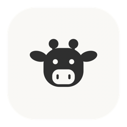
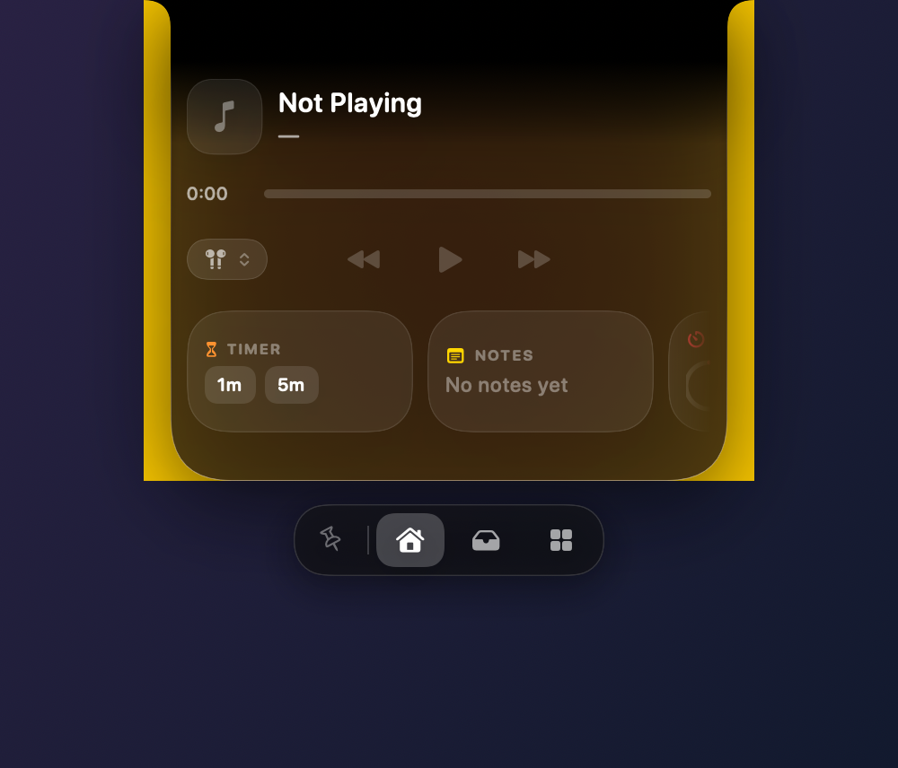
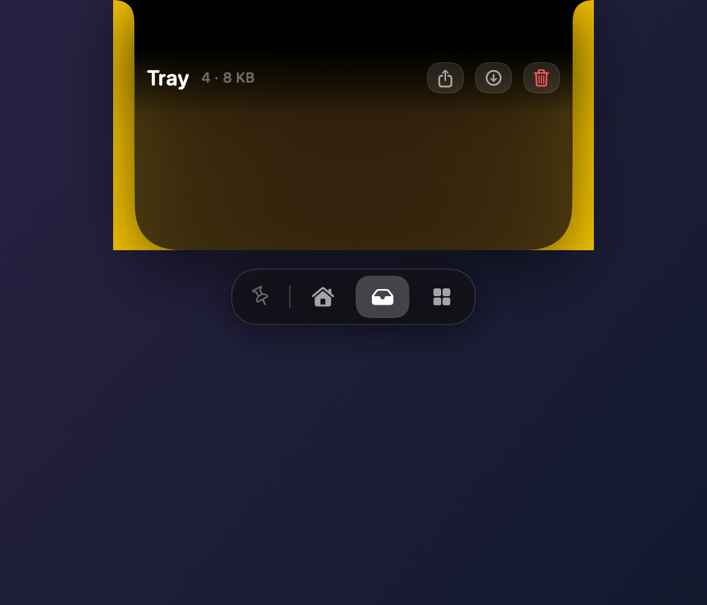
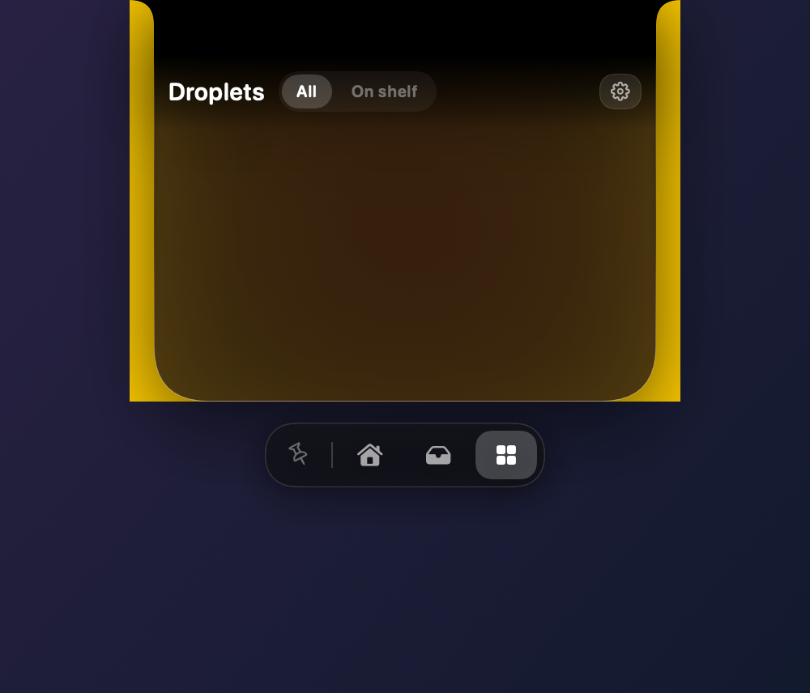
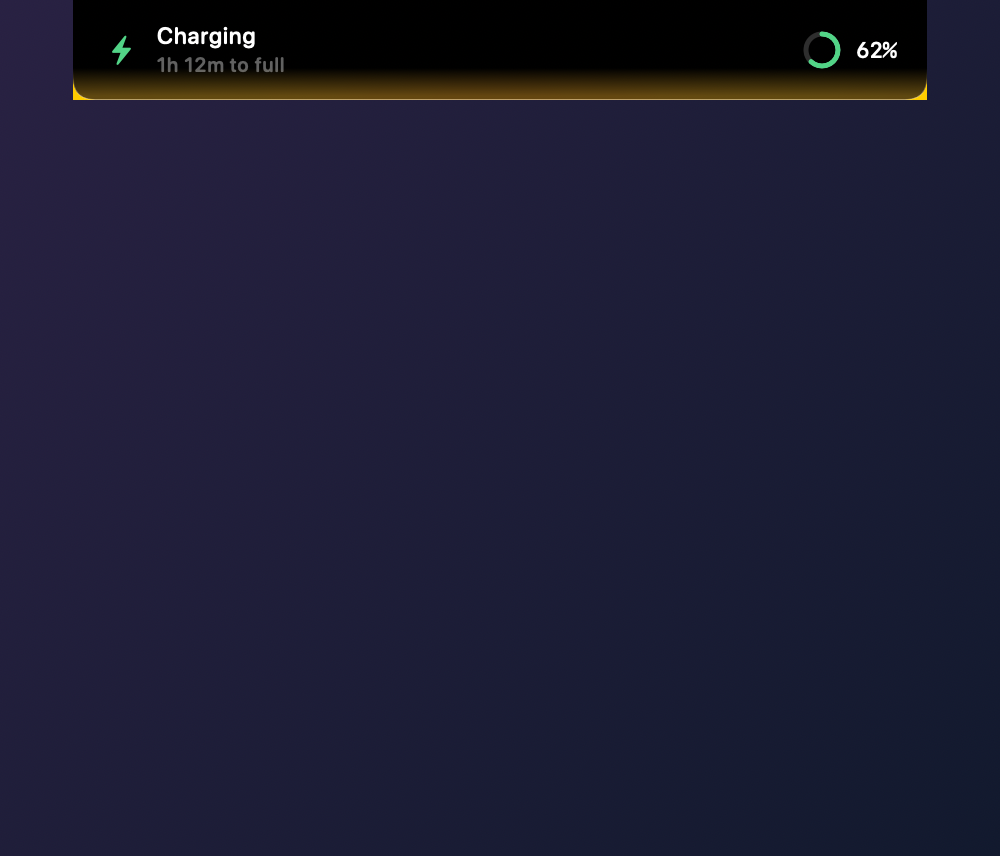

# Cowly

A Dynamic Island for the Mac notch — file shelf, media player, clipboard
history, live activities and switchable extensions. Local-only, free, no
account. Built with SwiftUI on macOS 26.

<p align="center">
  
</p>

<p align="center">
  
  
</p>

<p align="center">
  
  
</p>

**Requirements**: macOS 14 or later. Xcode 26 and
[XcodeGen](https://github.com/yonaskolb/XcodeGen) to build.

```bash
brew install xcodegen
make run
```

## Install

Grab the `.dmg` from [Releases](https://github.com/emrek0ca/cowly/releases),
drag **Cowly** into **Applications**, then run:

```bash
xattr -dr com.apple.quarantine /Applications/Cowly.app
```

Cowly is signed with an official **Apple Developer ID Application** certificate (Osman Emre Koca) and Hardened Runtime. If macOS asks to verify on first launch, you can open **System Settings › Privacy & Security**, scroll down and click **Open Anyway**, or run the command above.

Run the command **after** the app is in Applications; running it against the
mounted disk image does nothing, because that volume is read-only.

Prefer not to use Terminal? Double-click Cowly once and let it be blocked, then
open **System Settings › Privacy & Security**, scroll to the bottom and click
**Open Anyway**. The button only appears after a blocked attempt. On macOS 15
and later the old right-click → Open trick no longer works.

## Build it yourself

```bash
brew install xcodegen
make run
```

Building locally sidesteps all of the above — nothing is quarantined.

Everything below is in Turkish — it is the working documentation for the
project, including why several things are built the way they are.

---

macOS çentiği için Dynamic Island — dosya rafı, medya oynatıcı, pano geçmişi,
canlı aktiviteler ve açılıp kapatılabilen eklentiler. Tamamen yerel, ücretsiz,
lisanssız. SwiftUI + Liquid Glass (macOS 26).

## Çalıştırma

```bash
open build/Build/Products/Debug/Cowly.app
```

Yeniden derlemek için:

```bash
xcodegen generate && xcodebuild -project Cowly.xcodeproj -scheme Cowly -configuration Debug -derivedDataPath build build
```

Xcode'da açmak için `Cowly.xcodeproj`.

## Kullanım

| Hareket | Sonuç |
|---|---|
| Çentiğin üzerine gel | Raf açılır |
| Çentiğe dosya sürükle | Tray'e düşer |
| Sürüklerken fareyi salla | Sepet imdada yetişir |
| ⌥⌘C | Rafı aç/kapat (Erişilebilirlik izni ister) |
| ⌥⌘L | Ekran perdesini indir |
| Esc | Rafı kapat, sabitlemeyi kaldır |
| Raftaki 📌 | Rafı açık sabitle — menü açarken kapanmaz |
| Widget'ı tut ve kaydır | Home rafındaki sırayı değiştir |
| Ray üzerinde iki parmak kaydır | Widget'lar arasında gezin (oklar da var) |

## Özellikler

**Raf**: çentiğe oturan, donanım çentiğiyle birleşen kabuk. Çentiği olmayan
ekranlarda yüzen ada olarak çalışır. Fare hangi ekrandaysa oraya taşınır.

**Tray**: bırakılan dosyaların kopyası saklanır; orijinali silinse de kalır.
Dışarı sürükleme, Quick Look, Finder'da göster, paylaş (AirDrop), sabitle.

**Sepet**: sürüklerken fareyi sallayınca imleç altına gelir, bırakınca yakalar.

**Medya**: Apple Music ve Spotify AppleScript üzerinden, ayrıca sistem Now
Playing (MediaRemote) için en iyi çaba. Sürüklenebilir ilerleme çubuğu, çıkış
cihazı seçici, kapak renginden cam tonlaması.

**Pano**: metin/bağlantı/renk/görsel/dosya geçmişi, arama, sabitleme, ⌘V ile
gerçek yapıştırma. Parola yöneticilerinin gizli panoları atlanır.

**Canlı aktiviteler**: şarj/pil uyarıları, ses ve parlaklık HUD'ları, Pomodoro
ve zamanlayıcı ilerlemesi kapalı çentikte.

**Droplet'ler (14)**: Pomodoro, Zamanlayıcılar, Notlar, Takvim, Pano,
High Alert, Sistem İstatistikleri, Pil, Hava Durumu, Ses Çıkışı, Emoji,
Kamera, Hızlı Eylemler, AI Limits. Her biri ayrı açılıp kapanır; Ayarlar ›
Droplets altında kendi seçenekleri var — Pomodoro süreleri, hava durumu birimi,
istatistik aralığı, zamanlayıcı ön ayarları, pano limiti, takvim ufku, hangi
hızlı eylemlerin görüneceği, Claude blok bütçesi.

## Genişlik

Kapalı raf donanım çentiğinin birebir ölçüsünde — `auxiliaryTopLeftArea` ile
piksel piksel ölçülüyor. Çentik üzerindeyken üst köşe yarıçapı sıfır, yani şekil
çerçevesinin dışına taşmıyor. Çentiksiz ekranlarda ada ekran genişliğinin %11'i
(170–240pt arası) — 27" monitör 13" laptopla aynı ince şeridi almasın diye.

Açık raf bunun katı: Ayarlar › General › Shelf size'dan 1×–5×. Kaydırıcının
altında o anki piksel genişliği ve yoğunluk sınıfı yazıyor, hangi detayların
gizlendiğini görüyorsun.

### Yoğunluk sınıfları

İçerik genişliğe göre sabit bir sırayla detay bırakır — hiçbir panel yer
olduğunu varsaymaz:

| Genişlik | Sınıf | Gizlenenler |
|---|---|---|
| < 400pt | compact | Albüm satırı, kaynak rozeti, kalan süre, cihaz adı, widget aksesuarları |
| 400–540pt | regular | Albüm satırı, rozet metni |
| ≥ 540pt | roomy | — |

Widget genişliği, tray kartı ölçüsü, droplet ızgarasının sütun sayısı ve tüm
boşluklar aynı `ShelfLayout` değerinden türer:

| | compact | regular | roomy |
|---|---|---|---|
| Yan boşluk | 24pt | 30pt | 36pt |
| Üst boşluk (çentiğin altında) | 10pt | 14pt | 18pt |
| Alt boşluk | 27pt | 30pt | 36pt |
| Blok aralığı | 14pt | 17pt | 20pt |

Alt boşluk `max(yan boşluk, köşe yarıçapı × 0.8)` — düz bir cetvele göre eşit
görünen bir değer, 34pt'lik köşe eğrisinin içine giriyordu.

### Yükseklik içerikten gelir

Sabit yükseklik ya satırları sıkıştırıyor ya da altlarında boşluk bırakıyordu.
Artık panel, gösterdiği blokların toplamından ölçülüyor
(`ShelfLayout.contentHeight(for:topInset:hasShelfWidgets:)`), ve sekme
değiştirince yükseklik yumuşakça ona göre değişiyor. Medya bloğu
`fixedSize(vertical:)` ile doğal yüksekliğinde kalıyor — eskiden tüm boş alanı
yutup satır aralarını açıyordu.

## AI Limits droplet

Kodlama ajanlarının kendi yerel loglarını okuyup ne kadar hakkın kaldığını
gösterir:

- **Codex** gerçek kotayı session loguna yazıyor (`rate_limits.used_percent`,
  `resets_at`) — o çubuk birebir doğru.
- **Claude Code** yerelde kota tutmuyor. Bu yüzden oturum transkriptlerinden
  içinde bulunduğun 5 saatlik bloğun harcanan token'ını hesaplıyorum (cache
  okumaları dâhil). Ayarlar › Droplets › AI Limits'ten kendi blok bütçeni
  girersen yüzde olarak da gösteriyor.
- **Gemini CLI / Cursor** diske kullanım yazmıyor; yalnızca kurulu oldukları
  belirtiliyor. Uydurma yüzde göstermiyorum.

Loglar yüzlerce megabayt olabildiği için her dosya boyutuyla birlikte
hatırlanıyor ve yalnızca son geçişten sonra eklenen baytlar ayrıştırılıyor.

## Side Dock

Ekranın sol, sağ ve alt kenarına dock ekleyebilirsin; içine çentik rafındaki
droplet widget'larının aynısını koyuyorsun. Her dock için ayrı ayrı:

- Açık/kapalı
- Kenara yaklaşınca çıkma (auto-hide) veya hep görünür durma
- Kenar boyunca konum
- İçindeki widget'lar ve sıraları

Menü çubuğu › Side Docks'tan hızlıca açıp kapatabilir, Ayarlar › Side Docks'tan
detaylı düzenleyebilirsin. Gizliyken kenarda ince pembe bir tutamak kalıyor.

## Ekran perdesi ve sistem kilit ekranı

**macOS'un gerçek kilit/giriş ekranına üçüncü taraf bir uygulama katılamaz.**
Orada yalnızca Touch ID, Apple Watch ve giriş parolan çalışır.

⌥⌘L ile **Cowly Ekran Perdesi**: tüm ekranları kaplayan, saat, albüm kapağı ve
medya kontrolleri olan bir perde. Touch ID ile kalkıyor.

Sınırı net söyleyeyim: bu masaüstünü gizler, Mac'i kilitlemez. Cmd-Tab ya da
uygulamayı zorla kapatmak perdeyi aşar. Gerçek kilit için ⌃⌘Q hâlâ gerekli.

## İzinler

Cowly her izni ihtiyaç duyduğu anda kendisi ister. Accessibility, macOS'un
kendiliğinden sormadığı tek izin: açılışta sistem dialogu gösteriliyor, sonra
arka planda izleniyor — verdiğin an tuş yakalayıcı kendiliğinden başlıyor,
yeniden başlatmaya gerek yok. Ayarlar › About'ta hepsinin canlı durumu ve
"Allow…" düğmesi var.

**Not**: uygulama ad-hoc imzalı. Her yeniden derlemede macOS imzayı değişmiş
sayıp Accessibility iznini düşürebiliyor; öyle olursa listeden Cowly'yi çıkarıp
yeniden eklemek gerekiyor.

## Eski izin listesi

Erişilebilirlik (kısayol + yapıştırma), Otomasyon (Music/Spotify),
Kamera (Kamera droplet'i canlı önizleme), Takvim, Konum (hava durumu).
Hepsi ilk kullanımda istenir; Ayarlar › About altından sistem paneline gidilir.

## Veri

`~/Library/Application Support/Cowly/` — tray dosyaları, pano geçmişi, notlar.
Hiçbiri cihazdan çıkmıyor, hesap yok, telemetri yok.

## Çentikle birleşme

Çentik, ekranda fiziksel bir delik. Orada en ufak saydamlık, donanımla uygulama
arasında bir dikiş gibi görünüyor. Bu yüzden raf, çentik yüksekliği boyunca tam
opak siyah; aşağı indikçe cama dönüşüyor. Bu, seçilen görünüm stilinden bağımsız
olarak her zaman böyle — sebebi dekoratif değil, fiziksel.

## Marka

İnek işareti tek yerde tanımlı: `CowGeometry`, her ölçüyü tuvalin oranı olarak
tutuyor. Aynı geometri 1024pt'lik uygulama ikonunu, 18pt'lik menü çubuğu
şablonunu ve uygulama içindeki glifi çiziyor — üçü birbirinden ayrı düşemiyor.
Menü çubuğunda 20pt altında burun delikleri kapanıp leke olduğu için
düşürülüyor, yüzü gözler taşıyor.

## Liquid Glass kuralı

Cam, arkasındaki şeye açılan bir penceredir; camın içine cam koyunca kıracak
yeni bir şey kalmaz, iki katman da bulanıklaşır. Bu yüzden her yüzen pencerede
**tek** cam katmanı var: raf, dock, sepet, sekme çubuğu. Onların içindeki her
şey düz yarı saydam kart (`.card()`) veya baloncuk kontrol (`.controlBubble()`).

Köşe yarıçapları tek bir ölçekten geliyor (`Radius`); kart yarıçapı yüksekliğin
%34'ü, 22pt'de sınırlanıyor — hiçbir şey düz dikdörtgen gibi durmuyor.

Saf Liquid Glass neredeyse şeffaf: arkada parlak bir pencere varken rafın kendi
yazısı okunmuyordu. Camın altında bir karartma katmanı var (varsayılan %42,
Ayarlar › Appearance'tan, ekran başına ayrı ayrı da ayarlanabiliyor).

Kenar üç ayrı katmandan oluşuyor (`GlassRim`): üstte parlak spektral çizgi,
onun hemen içinde camın kalınlığını veren koyu bant, altta geri yansıyan ışığı
yakalayan ince dudak. Raf açılırken yüzeyi bir kez ışık süpürüyor
(`GlassSheen`) — tekrarlayan animasyon yok, boştayken hiçbir şey dönmüyor.
Raf ve sekme çubuğu aynı `GlassEffectContainer` içinde ve `glassEffectID`
taşıyor, böylece açılıp kapanırken iki ayrı dikdörtgen gibi değil tek bir sıvı
kütle gibi ayrılıp birleşiyorlar.

**Panel içindeki kontrol kuralı**: bu borderless, non-activating panelde AppKit
tabanlı kontroller tekrar tekrar bozuldu — `Menu` rafın arkasında açıldı,
segmented `Picker` hiç çizilmedi. Bu yüzden panelde hiçbir AppKit kontrolü
kalmadı: menüler `NSMenu`'yü doğrudan sürüyor (`ShelfMenuButton`), kaydırıcılar
sürükleme jestinden yapıldı (`ShelfSlider`), filtreler düz dokunma çipi. Ayarlar
penceresi normal bir pencere olduğu için orada standart kontroller kullanılıyor.

**İki kural, ikisi de acı deneyimden**:

1. `Glass.interactive()` yalnızca camın *kendisi* bir kontrolse kullanılır.
   Buton kabını interaktif camla sarınca basışı cam yutuyor, içindeki butonlar
   ölüyor — sekme çubuğunda tam olarak bu oluyordu.
2. `glassEffectID`, üzerinde `glassEffect` olmayan bir view'a takılırsa —
   üstelik `GlassEffectContainer` içindeyse — sistem materyali hiç çizilmiyor
   **ve içeriğini de yutuyor**. Raf bu yüzden tamamen boş görünüyordu. Katman
   dökümü kanıtladı: cam view'ının altında tek bir çizim katmanı yoktu.
3. Bu yüzden görünürlük artık doğrulayamadığım bir API'ye bağlı değil.
   `GlassSurface` kendi materyalini çiziyor (`.regularMaterial` + karartma +
   ışık rampası), sistem camı da **arkasına** ekleniyor: kırılmayı o veriyor
   ama hiçbir şeyi gizleyemiyor. Katman dökümünde ikisi de görünüyor —
   Apple'ın `SDFLayer`'ı ve kendi `CABackdropLayer`'ım.

Bu tür şeyleri gözle doğrulayamadığım için `--layer-dump` tanı modu var:
rafın gerçek Core Animation ağacını basıyor.

## Droplet ve shelf düzenleme

Kişiselleştirmenin hiçbir parçası tek bir jeste ya da hover'da beliren bir
kontrole bağlı değil — ıskalayan bir sürükleme, özelliği bozukmuş gibi
gösteriyor. Her işlemin en az iki yolu var:

| İşlem | Yollar |
|---|---|
| Ekle / çıkar | Droplets sekmesindeki kutucuk rozeti · kutucuğun sağ tık menüsü · Ayarlar › Droplets |
| Sırala | Raftaki kartı tutup kaydır · kartın sağ tık menüsü (sola/sağa) · Ayarlar › Droplets › Home shelf (yukarı/aşağı) |
| İncele | Kutucuğa tıkla (bu **eklemez**) · sağ tık › Open |

Droplets sekmesinde "All / On shelf" filtresi var, rozet her zaman görünür
(hover'a bağlı değil), ve bir droplet'i açıp bakmak onu rafına eklemiyor —
eklemek ayrı ve açık bir eylem.

## Çoklu monitör

Ayarlar › Displays'te takılı her ekran ayrı ayrı listeleniyor. Ekran başına:

- Cowly o ekranda görünsün mü
- Açık raf genişliği (global çarpanı ezer)
- Çentiksiz ekranlarda ada boyutu (ekran genişliğinin oranı olarak)
- Cam karartma oranı
- Raf hangi sekmeyle açılsın

Her ayarın yanında bir onay kutusu var: kapalıysa global değer kullanılıyor,
açtığında o ekrana özel değere geçiyor. Profiller ekranın vendor/model/seri
kimliğiyle saklanıyor, yani monitörü çıkarıp taktığında veya sıralamayı
değiştirdiğinde ayarların yerinde kalıyor. Artık takılı olmayan ekranların
ayarları "Remembered, not attached" altında duruyor; istersen unutturuyorsun.

## Mimari

```
Cowly/
├── App/          uygulama girişi, menü çubuğu, tanı araçları
├── Notch/        panel, geometri, durum makinesi, raf görünümleri
├── Design/       tasarım jetonları + responsive düzen, cam katmanı, çentik
│                 şekli, hareket eğrileri, inek marka
├── Features/
│   ├── Tray/     dosya rafı + bırakma işleme
│   ├── Basket/   sallama algılama + yüzen sepet
│   ├── Media/    sağlayıcılar, denetleyici, ses çıkışı, oynatıcı arayüzü
│   ├── Clipboard/pano izleyici ve deposu
│   ├── HUD/      ses/parlaklık HUD'u
│   ├── LiveActivity/ pil izleyici, aktivite modeli
│   ├── Droplets/ kayıt defteri, motorlar, widget'lar, paneller
│   ├── AIUsage/  ajan loglarından kalan kullanım hakkı
│   ├── Displays/ ekran başına profiller
│   ├── SideDock/ kenar dock'ları
│   ├── LockScreen/ ekran perdesi
│   └── Security/ Touch ID kapısı, kilit ekranı
├── Settings/     ayarlar penceresi
└── Support/      tercihler, disk, yardımcılar
```

## Geliştirici notu

Ekran kaydı izni olmadan doğrulamak için üç tanı modu var:

```bash
Cowly.app/Contents/MacOS/Cowly --render-preview <klasör>   # rafı PNG'ye basar
Cowly.app/Contents/MacOS/Cowly --hit-test                  # butonlara tıklama ulaşıyor mu
Cowly.app/Contents/MacOS/Cowly --ai-usage                  # AI loglarından okunanlar
```

`--render-preview` ayrıca `layout-<genişlik>.png` dosyaları üretir: gerçek
`OpenShelfView`, gerçek ölçüsünde, her bloğun sınırı çizili. Dikey alanın nereye
gittiğini görmenin tek güvenilir yolu buydu.

Hiçbiri gerçek tercihleri veya tray'i değiştirmez.

## Droppy ile farkı

Droppy'nin 36 droplet'i, iOS senkronizasyonu ve bulut paylaşımı var; burada
14 droplet var ve her şey yerel. Raf, tray, sepet, pano, HUD'lar, canlı
aktiviteler ve kilit akışı birebir aynı fikirle, sıfırdan yazıldı.